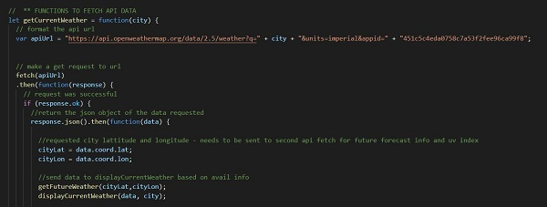

# Weather-On-Demand Dashboard

**This is a README fort the creation of a Weather Dashboard, developed using my newly acquired skills in the use of API's, JavaScript, CSS and HTML.  Some of the methods and skills I used are noted below:**

* Comments were added to the script.js file as pseudocode and organization purposes.

* Bootstarp was utilized as a CSS framework for the layout

* The Web API moment.js was utilized to obtain and insert formatted dates:

* The fetch() method was utlized for both API requests; the secondary API request required data from the first request, which were defined in the secondary function as its parameters:

* A "For Loop" was utilized to iterate through an array of seven days and its key/value pairs; select data was then obtained and dynamically displayed on the browswer.

## Deployed Application

* [Work Day Scheduler](https://erin-michon.github.io/weather-on-demand/)

## Future Goals
* Obtain support and work to complete the full acceptance criteria shown below:

    * WHEN I view the UV index
    * THEN I am presented with a color that indicates whether the conditions are favorable, moderate, or severe
    * WHEN I click on a city in the search history
    * THEN I am again presented with current and future conditions for that city 
